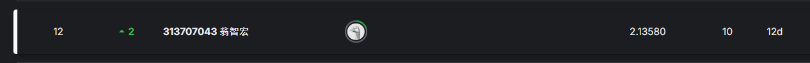

# 智能所-Machine Learning Lab3-語音轉文字辨識 RNN模型辨識
## Author：國立陽明交通大學 資訊管理與財務金融學系財務金融所碩一 313707043 翁智宏

本次是機器學習第三次作業，訓練一個台語語音辨識模型，要能夠辨識出 **單人女聲聲音（高雄腔）**。
我們採用 **迴歸神經網路 (Recurrent Neural Network, RNN)** 作為模型基礎，進行語音的辨識。

Kaggle Competition：[點擊這裡](https://www.kaggle.com/competitions/nycu-i-al-i-ml-2024-seq-2-seq-and-attention/overview) 競賽連結

最終成績如下所示：



> 準確率在 2.13580 左右 (越小越好)
---

## 任務說明
### 規格
1. **單人女聲聲音（高雄腔）**
2. **輸入：台語語音音檔（格式：wav檔, 22 kHz, mono, 32 bits）**
3. **輸出：台羅拼音（依教育部標準）**

### Evaluation
1. 只看台羅拼音，而且不管音調，辨認輸出範例如下：
"li be e mih kiann lan lan san san long be tsiau tsng"

2. 因為Kaggle的限制，評分標準使用 Mean Levenshtein Distance （正常對台羅拼音而言，應該使用word error rate, WER）
   
3. The evaluation metric for this competition is Mean Levenshtein Distance calculated for each sentence in char-level. 此值越小越好，最小=0！
   
4. Levenshtein distance between two character sequence (predicted sequence v.s. target sequence) is the minimum number of single-character edits (insertions, deletions or substitutions) required to change one word into the other.
>  LevDistance = #. of ins + #. of del + #. of Sub

---

## Dataset Description

**注意檔案很大**

1. 訓練音檔：train目錄（請忽略._*.wav，這是mac電腦的隱藏暫存檔）
2. 測試音檔：test目錄（請忽略._*.wav，這是mac電腦的隱藏暫存檔）
3. 字典：lexicon.txt（教育部部定台羅拼音，子音，母音）
4. 訓練資料列表：train.csv（id, text）
5. 答案範例檔：sample.csv（id, text）

**注意先用sox轉音檔格式，轉成 16 kHz sampling, signed-integer, 16 bits**
>  sox in.wav -r 16000 -e signed-integer -b 16 out.wav

## 模型介紹
使用了四種模型去實作出此題目的功能。
1. DeepSpeech2 (老師給予的範例修改)
2. LSTM
3. Transformer
4. **Whisper (表現最好)**
   - 使用Whisper產生的模型.pth後，要在model的資料夾中補上 **preprocessor_config** [下載](https://huggingface.co/llava-hf/llava-v1.6-vicuna-13b-hf/blob/main/preprocessor_config.json)

## 安裝依賴
請使用以下指令安裝本專案所需的依賴套件：

```bash
pip install --upgrade datasets[audio] transformers accelerate evaluate jiwer tensorboard gradio
```
---

## 實作 (這邊介紹 Whisper 為例)
### 第一步：資料預處理
#### 1. 引入需要的套件
```python
from datasets import load_dataset, DatasetDict
from transformers import (
    WhisperTokenizer,
    WhisperProcessor,
    WhisperFeatureExtractor,
    WhisperForConditionalGeneration,
    Seq2SeqTrainingArguments,
    Seq2SeqTrainer,
    WhisperProcessor,
)

from datasets import Audio, Dataset
from dataclasses import dataclass
from typing import Any, Dict, List, Union
 
import torch
import evaluate
import torchaudio
import pandas as pd
import os
import glob
import re
import json
```


#### 2. 設定路徑和模型
```python
model_id = 'openai/whisper-tiny'
out_dir = 'whisper_small_atco2'
epochs = 1
batch_size = 64
```

#### 3. 將 lexicon.txt 字典資料先去做處理
```python
train_df = pd.read_csv("train-toneless.csv")
with open("lexicon.txt", encoding="utf-8") as f:
    lexicon_lines = f.readlines()

# 解析 lexicon
lexicon_dict = {}
for line in lexicon_lines:
    if line.strip():  # 確保不是空行
        parts = line.split()
        if len(parts) == 3:  # 格式確保為「拼音 子音 母音」
            lexicon_dict[parts[0]] = {"consonant": parts[1], "vowel": parts[2]}

# 處理 train-toneless.csv 的文字資料
processed_data = []
for _, row in train_df.iterrows():
    text_id = row["id"]
    text = row["text"]
    words = text.split()  # 將句子切分為單詞
    word_dict = []
    for word in words:
        if word in lexicon_dict:
            word_dict.append({
                "word": word,
                "consonant": lexicon_dict[word]["consonant"],
                "vowel": lexicon_dict[word]["vowel"]
            })
        else:
            word_dict.append({
                "word": word,
                "consonant": None,
                "vowel": None
            })
    processed_data.append({"id": text_id, "words": word_dict})

with open("processed_train.json", "w", encoding="utf-8") as f:
    json.dump(processed_data, f, ensure_ascii=False, indent=2)

print("資料處理完成！結果存為 processed_train.json")
```

#### 4. 將字典資料格式轉成 whisper 模型需要的格式
```python
with open("processed_train.json", "r", encoding="utf-8") as f:
    data = json.load(f)

# 初始化存儲音頻路徑和對應文字轉錄的列表
audio_paths = []  # 假設有對應的音頻文件路徑，例如 'train_converted/1.wav'
texts = []  # 對應的文字轉錄

# 處理每一條數據
for item in data:
    # 修改音頻文件路徑，將音頻放在 'train_converted' 文件夾下
    audio_path = f"train_converted/{item['id']}.wav"  # 修改此處根據音頻文件所在的文件夾
    words = [word["word"] for word in item["words"]]  # 提取所有單詞
    sentence = " ".join(words)  # 將單詞連接為句子
    audio_paths.append(audio_path)
    texts.append(sentence)

transcriptions_df = pd.DataFrame({"audio": audio_paths, "text": texts})
transcriptions_df.to_csv("transcriptions.csv", index=False, encoding="utf-8")

print("生成文字轉錄並保存為 transcriptions.csv")
```

#### 5. 切割資料集
```python
dataset = Dataset.from_pandas(transcriptions_df)

# 手動劃分數據
train_test_split = dataset.train_test_split(test_size=0.2)  # 20% 作為驗證集
atc_dataset_train = train_test_split['train']
atc_dataset_valid = train_test_split['test']

# 查看修改後的數據集
print(atc_dataset_train)
print(atc_dataset_valid)
```

#### 6. 初始化 Processor
```python
model_id = "openai/whisper-small"  # 可以選擇其他大小的模型

# 載入特徵提取器
feature_extractor = WhisperFeatureExtractor.from_pretrained(model_id)

# 自定義 Tokenizer 支持台羅拼音
tokenizer = WhisperTokenizer.from_pretrained(
    model_id, 
    language="Chinese",  
    task="transcribe"
)

# 合併特徵提取器和 Tokenizer 為 Processor
processor = WhisperProcessor.from_pretrained(
    model_id, 
    language="Chinese",  
    task="transcribe"
)

print("Processor 加載完成！")
```

#### 7. 設計物件專們處理 whisper 中讀取的特徵值
```python
@dataclass
class DataCollatorSpeechSeq2SeqWithPadding:
    processor: Any
    padding: Union[bool, str] = True

    def __call__(self, features: List[Dict[str, Any]]) -> Dict[str, torch.Tensor]:
        # 將 input_features 提取出來，進行 padding
        input_features = [feature["input_features"] for feature in features]
        labels = [feature["labels"] for feature in features]
        
        # 將 input_features 和 labels 分別處理
        batch = {
            "input_features": torch.tensor(input_features, dtype=torch.float32),
            "labels": torch.nn.utils.rnn.pad_sequence(
                [torch.tensor(label, dtype=torch.long) for label in labels],
                batch_first=True,
                padding_value=self.processor.tokenizer.pad_token_id
            )
        }
        return batch
```

### 第二步：模型訓練
#### 1. 模型訓練
```python
# 定義資料預處理函式
def prepare_dataset(example):
    inputs = processor(example["audio"]["array"], 
                       sampling_rate=example["audio"]["sampling_rate"], 
                       text=example["text"])

    example["input_features"] = inputs["input_features"][0]
    example["labels"] = inputs["labels"]
    return example

# 確保 audio 欄位為 datasets Audio 類型
atc_dataset_train = atc_dataset_train.cast_column("audio", Audio(sampling_rate=16000))
atc_dataset_valid = atc_dataset_valid.cast_column("audio", Audio(sampling_rate=16000))

# 對訓練與驗證集進行 map 處理
atc_dataset_train = atc_dataset_train.map(prepare_dataset, remove_columns=atc_dataset_train.column_names)
atc_dataset_valid = atc_dataset_valid.map(prepare_dataset, remove_columns=atc_dataset_valid.column_names)

# 載入預訓練 Whisper 模型
model = WhisperForConditionalGeneration.from_pretrained(model_id)

# 設定訓練參數
training_args = Seq2SeqTrainingArguments(
    output_dir=out_dir,
    per_device_train_batch_size=1,  
    per_device_eval_batch_size=1,
    gradient_accumulation_steps=4,
    evaluation_strategy="epoch",
    num_train_epochs=epochs,
    learning_rate=1e-4,
    warmup_steps=500,
    save_steps=1000,
    logging_steps=100,
    report_to="none",  # or "tensorboard"
    prediction_loss_only=True,
    fp16=True  
)

data_collator = DataCollatorSpeechSeq2SeqWithPadding(processor=processor, padding=True)

# 評估指標(可使用 WER)
wer = evaluate.load("wer")

def compute_metrics(pred):
    pred_ids = pred.predictions
    label_ids = pred.label_ids
    pred_str = processor.tokenizer.batch_decode(pred_ids, skip_special_tokens=True)
    label_str = processor.tokenizer.batch_decode(label_ids, skip_special_tokens=True)
    wer_score = wer.compute(predictions=pred_str, references=label_str)
    return {"wer": wer_score}

# 初始化 Trainer
trainer = Seq2SeqTrainer(
    args=training_args,
    model=model,
    train_dataset=atc_dataset_train,
    eval_dataset=atc_dataset_valid,
    tokenizer=processor.feature_extractor, 
    data_collator=data_collator,
    compute_metrics=compute_metrics
)

# 開始訓練
trainer.train()

trainer.save_model(training_args.output_dir)  
processor.save_pretrained(training_args.output_dir)
```

### 第三步：模型推理
#### 1. 模型推理階段
```python
# 定義正規化轉錄結果的函式
def normalize_transcription(transcription):
    """
    正規化轉錄結果，確保 'iNULL' 和後面的字母之間有空格，
    並移除所有的 'iNULL'。
    """
    print(f"原始轉錄結果: {transcription}")
    
    # 在 'iNULL' 和後面的字母之間插入空格
    normalized_transcription = re.sub(r'(iNULL)(?=[a-zA-Z])', r'\1 ', transcription)
    print(f"插入空格後: {normalized_transcription}")
    
    # 移除所有的 'iNULL'
    normalized_transcription = re.sub(r'iNULL', '', normalized_transcription)
    print(f"移除 'iNULL' 後: {normalized_transcription}")
    
    # 移除多餘的空格
    normalized_transcription = re.sub(r'\s+', ' ', normalized_transcription).strip()
    print(f"最終正規化結果: {normalized_transcription}")
    return normalized_transcription

# 載入微調後的模型和處理器
model_dir = 'whisper_small_atco2/checkpoint-6230'  # 您的 output_dir
processor = WhisperProcessor.from_pretrained(model_dir)
model = WhisperForConditionalGeneration.from_pretrained(model_dir)

device = torch.device("cuda" if torch.cuda.is_available() else "cpu")
model.to(device)

print("模型和處理器已成功載入！")

# 定義測試音檔資料夾
test_audio_folder = 'test_converted/'

# 自然排序函數
def natural_sort_key(path):
    return [int(text) if text.isdigit() else text.lower() for text in re.split(r'(\d+)', path)]

test_audio_paths = sorted(glob.glob(os.path.join(test_audio_folder, '*.wav')), key=natural_sort_key)
test_ids = [os.path.splitext(os.path.basename(path))[0] for path in test_audio_paths]

# 創建 DataFrame
test_df = pd.DataFrame({
    'id': test_ids,
    'audio': test_audio_paths
})

print(f"測試資料載入完成，共有 {len(test_df)} 筆資料。")

results = []

# 進行預測
for idx, row in test_df.iterrows():
    audio_path = row['audio']
    
    try:
        # 讀取音檔
        audio_input, sample_rate = torchaudio.load(audio_path)
        print(f"處理音檔: {audio_path}, 原取樣率: {sample_rate}, 原聲道數: {audio_input.shape[0]}")
    
        # 如果音頻有多個聲道，轉換為單聲道
        if audio_input.shape[0] > 1:
            audio_input = torch.mean(audio_input, dim=0)
            print(f"轉換為單聲道, 新形狀: {audio_input.shape}")
    
        # 確保音頻是一維
        audio_input = audio_input.squeeze(0)
    
        # 如果取樣率不是 16kHz，進行重新取樣
        if sample_rate != 16000:
            resampler = torchaudio.transforms.Resample(orig_freq=sample_rate, new_freq=16000)
            audio_input = resampler(audio_input)
            sample_rate = 16000
            print(f"重新取樣為 16kHz, 新取樣率: {sample_rate}")
    
        # 將 PyTorch 張量轉換為 NumPy
        audio_input = audio_input.numpy()
    
        # 傳入處理器
        inputs = processor(audio_input, sampling_rate=sample_rate, return_tensors="pt")
        print(f"Input features shape: {inputs['input_features'].shape}")
        inputs = {k: v.to(device) for k, v in inputs.items()}
    
        # 生成預測
        with torch.no_grad():
            predicted_ids = model.generate(**inputs)
        print(f"Predicted IDs shape: {predicted_ids.shape}")
    
        # 解碼預測結果
        transcription = processor.decode(predicted_ids[0], skip_special_tokens=True)
        print(f"解碼後的轉錄結果: {transcription}")
    
        # 正規化轉錄結果
        transcription = normalize_transcription(transcription)
        print(f"正規化後的轉錄結果: {transcription}")
    
        # 將正規化後的轉錄結果直接寫入 CSV
        results.append({
            'id': row['id'],
            'text': transcription
        })
    
        print(f"完成預測：ID={row['id']}, 轉錄結果={transcription}")
    
    except Exception as e:
        print(f"錯誤：處理音檔 {audio_path} 時出錯，錯誤訊息：{e}")
        results.append({
            'id': row['id'],
            'text': ''
        })

results_df = pd.DataFrame(results)
print("所有測試資料預測完成。")

results_df.to_csv("sample.csv", index=False, encoding="utf-8")
print("結果已保存至 sample.csv")
```
